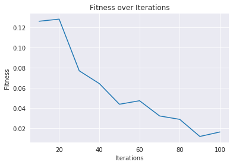

# Metaheuristics for Optimization TP5
Ning, Tientso
24 November, 2019

# Introduction
The problem is to create a simple, three-layered, neural-net in order to categorize hand-written digits. The back-propagation (optimization) aspect of the neural-net is done using the Particle Swarm Optimization algorithm (PSO) to minimize loss. The PSO algorithm is a collective-work algorithm that leverages many smaller components in order to yield a collective solution.

# Methodology
A neural net is made up of many layers, consisting of nodes and activation functions. For our assignment, the neural-net is a three-layered net, taking an input of an 20x20 image (in flattened form) and outputting a single digit prediction 0 or 1 (corresponding to "3" or "2").

The first layer of the neural-net takes an input image of 20x20, and flattens it to a 1x400 vector. It then adds a singular bias value, and passes this 401 vector onto the second layer.

The second layer of the neural-net takes the 401 vector and performs a matrix multiplication with matrix theta1 (which is part of the theta1 theta2 pair, acting as the weights of the neural-net, and the particle in our PSO). Theta1 has the dimensions 25x401, turning the resulting matrix into a 1x25 dimension matrix. The sigmoid function is applied in the second layer, along with another bias. The output from layer two is a 1x26 matrix.

The third layer of the neural net applies another matrix multiplication with theta2 (part of the theta1 theta2 pair). Theta2 is a 26x1 matrix, turning the final result into a 1x1 matrix (or singular value prediction). The sigmoid function is applied, and the output is a prediction value between 0 and 1.
During evaluation, the prediction is rounded to the nearest integer value (0 or 1) to count as the prediction, but the value itself before rounding could be considered the "confidence value" of the neural-net.

The PSO algorithm is a process of spawning many particles, each with individual positions and velocities. The particles move in the search-space according to their position and velocity, as well as in relation to the particle with the best fitness. Each particle's movement is defined by it's own position and velocity, and velocities are updated according to the equation:

$$
\boldsymbol{v}_{t+1}^{i}=\omega \boldsymbol{v}_{t}^{i}+c_{1} r_{1}\left(\boldsymbol{b}_{t}^{i}-\boldsymbol{s}_{t}^{i}\right)+c_{2} r_{2}\left(\boldsymbol{b}_{t}^{G}-\boldsymbol{s}_{t}^{i}\right)
$$

The intuition is that each particle will move according to trying to move towards the particle with the best fitness amongst the group, as well as move towards where it had the best fitness itself. These two guiding concepts are established variables and defined as the cognitive and social affinity of each particle (defined in our assignment as c1 and c2). There is also an established Inertia Constant, which acts to help prevent abrupt spikes in velocity. These values assist in making sure that the particles are able to properly explore the search space as well as exploit the search space for an optimal solution. The fitness function is provided as:

$$
J\left(\Theta_{1}, \Theta_{2}\right):=\frac{1}{m} \sum_{k=1}^{m}\left(y_{k}-h_{\Theta_{1}, \Theta_{2}}\left(x_{k}\right)\right)^{2}
$$

The set up of the problem establishes the two matrices theta1 and theta2 pair, as a single particle in our PSO. Thus, the problem is about optimizing to see which particle (set of weights) gives us the proper prediction results (learning a set of weights) over the set of images in our dataset.

# Results

Run | Fitness Value | Prediction Error |
--- | --- | --- |
1 | 0.0020812038887232927 | 0.0 |
2 | 0.0018613057836248423 | 0.0 |
3 | 0.0016785848636784756 | 0.0 |
4 | 0.0032176760351827504 | 0.0 |
5 | 0.0020581811150554400 | 0.0 |
6 | 0.0052839376679271900 | 0.05 |
7 | 0.0024315360392561300 | 0.0 |
8 | 0.0019122750124164996 | 0.0 |
9 | 0.0005050333698191652 | 0.0 |
10 | 0.004716182299268048 | 0.0 |

(Table 1: Table of Fitness Values and Prediction Errors)

# Discussion
The results show that our algorithm is able to  achieve an average fitness value of 0.0025745916, with an average prediction error of 0.05, meaning that the PSO algorithm is able to optimize the fitness of the function by minimizing prediction error, and find the weight matrices theta1 and theta2 to allow the neural-net to achieve its prediction accuracy.

It is important to note, that according to the assignment instructions, we are only making our predictions on the testing set, which explains why our prediction error is 0.0 for all runs. It can be expected that on images we have not trained on, that our error would be larger. However, that is beyond the scope of the assignment and is not a consideration for this time. Additionally, our fitness values indicate that our PSO algorithm is indeed optimizing the weight matrices, as the fitness is close to 0.0.

We chose 20 particles at 200 iterations since those values gave the best results on our search space, and gave us a reasonable run-time.
As the number of particles increased, we see an improvement in the exploration of the algorithm allowing us to better converge to an optimal solution. However, as the number of particle increases, we can also expect an increase in run-time. The number of particles help us explore the search space, meaning that an inadequate number of particles could lend to seeing unstable results, having less of a guarantee that the algorithm will converge on the global-optimum.
As seen in the graph, as the number of iterations increased, the algorithm was able to better exploit the search space and converge to the global-optimum, allowing our algorithm to perform well. At 200 iterations, we can see that the fitness is well-close to zero, which is close to optimality.

Additionally, the velocity cutoff, Vmax, is critical to the ability to provide good results since a velocity that is too high would cause convergence issues as particles' positions are determined by adding the velocity to their current position, meaning a velocity that is too high would cause particles to alter its position too much too quickly for converging on a good solution. It is also important to note that we need to restrain the particle to be contained within the search space, which was set to be between -1 and 1 for our assignment. A velocity cutoff of 0.1 was chosen for our assignment, which is one-tenth of the domain of the search-space.

# Conclusion
In conclusion, our PSO algorithm was able to optimize the theta1 theta2 matrix pair, allowing our neural-net to make correct predictions on the image dataset.
