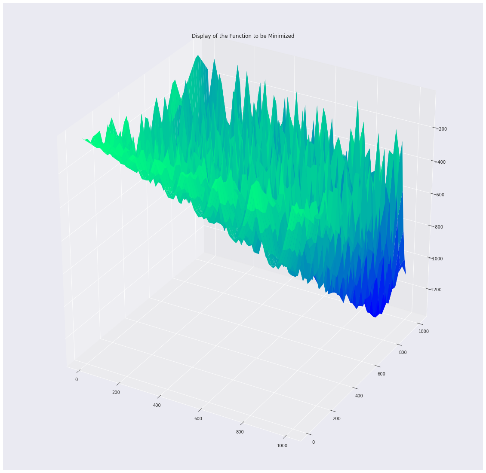

# Metaheuristics for Optimization TP6
Ning, Tientso
05 December, 2019

# Introduction
The Genetic Algorithm (GA) has its basis in evolutionary theory, wherein a population of individuals slowly overtime produce individuals whose fitness is high. This "survival of the fittest" is the principal driving factor in the optimization of this algorithm. For our problem, we are concerned with finding the global minimum of the function:

$$
f(x, y)=-\left|\frac{1}{2} x \sin (\sqrt{|x|})\right|-|y \sin (30 \sqrt{\left|\frac{x}{y}\right|})|
$$

The problem is represented as each individual as a potential solution, and each solution encoded as a binary sequence made up of two parts x and y (first and second half). The population undergoes selection, crossover, and mutation at each generation (iteration of the algorithm), resulting in a final population of individuals that contains at least one individual that minimizes the above function (best fitness).

# Methods

## Selection
The selection method chosen for the assignment was the "5-tournament selection method." The process describes picking 5 individuals randomly from the current population, and hosting a "tournament" which is essentially comparing the fitness of the chosen individuals. The individual with the best fitness that optimizes the function is considered the winner of the tournament, and is "selected" and placed into the next population. This tournament process continues until the future population has the same amount of individuals as the current population. This process assists in keeping the better fitness solutions while "forgetting" the worse solutions.

## Crossover
Crossover is the process of swapping the x or y values of two individuals with each other. The assignment chooses a one-point crossover mid-break policy, meaning that each individual's solution, which is a sequence of bits (20 bits total for our assignment) is split down the middle (10 bits for x and 10 bits for y) and the x or y values are swapped between two individuals. This crossover occurs given a certain probability that is defined and tested (see results). This simulates the process of passing on genes to off-springs in a population.

## Mutation
Mutation is the process of, given a probability of mutation, flipping or switching a bit in the individual's solution. This type of change to the fitness adds an element of entropy that could assist in exploring the search space and finding a good solution. This simulates the process of mutation in a population, wherein a population mutates and by chance, good mutations allow certain individuals to adapt better and survive, passing on their genes.

# Results and Discussion

## Function to be Minimized
First, from the image, it is clear that the function to minimize is very difficult to minimize. There are not only lots of local minimums, it is also not clear which area or region will provide the best solutions.

## Evaluating Probabilities of Mutation and Crossover
We tested two different probabilities of mutation Pm: 0.01 and 0.1, with and without crossover.

## Average Number of Generations
We first find the average value of the optimized value.
Then we obtained the average number of generations in order to find the optimized value.

## Success Rate and Cumulative Empirical Probability

# Conclusion
Our algorithm was able to reasonably optimize a very difficult to optimize function, by encoding the problem in a way to simulate a population of individuals evolving over time, utilizing the Genetic Algorithm approach.
